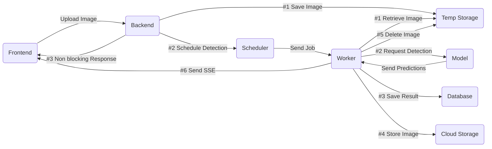

# Visionary - Full-Stack AI Image Detection Portfolio

## Table of Contents

1. [About](#about)
2. [Tech Stack](#tech-stack)
3. [Architecture](#architecture)
4. [Start the Demo](#start-the-demo)

## About

This repo was crafted to demonstrate how to build a resilient, full-stack system using modern tools and technologies, structured around Clean Architecture.

It showcases a complete application workflow, including:

- Frontend & UI Interactions
- Backend APIs & Business Logic
- Job Queues & Asynchronous Processing
- Storage & Database Management
- AI-Powered Features

The project highlights best practices in architecture, maintainability, and containerized workflows, making it easy to follow, run locally, and extend toward production deployments.

_Disclaimer: The AI Image Detection model used here is a local pre-trained model and may not be fully accurate. Its main purpose is to illustrate the implementation workflow; it can easily be replaced with a production-grade service like AWS Rekognition or GCP Vision._

## Tech Stack

### Frontend

- **Runtime:** Bun
- **Libraries:** React, React Router, Material UI
- **Forms & Validation:** React Hook Form, Zod
- **Dev Tools:** Vite, TypeScript, ts-prune, ESLint, Prettier

### Backend

- **Runtime:** Bun
- **Framework:** Hono
- **Database ORM:** Drizzle
- **Queues & Caching:** BullMQ + Redis
- **Database:** PostgreSQL
- **Storage:** MinIO (AWS-SDK for S3 compatible API)
- **Real-time Communication:** SSE / EventSource (Frontend notifications)
- **Dev Tools:** TypeScript, ts-prune, ESLint, Prettier, bun:test

### Model

- **Runtime:** Node (TensorFlow requires native bindings)
- **Libraries:** Hono, @tensorflow/tfjs-node, @tensorflow-models/coco-ssd
- **Dev Tools:** TypeScript, ts-prune, ESLint, Prettier, node:test

### Infrastructure

- **Containerization:** Docker
- **CI/CD:** GitHub Actions

## Architecture

The diagram below shows the AI Image Detection workflow, explaining how images travel through the system, how detection jobs are processed asynchronously, and how results are stored and delivered back to the frontend.



## Start the Demo

### Prerequisites

You will need [Docker Desktop](https://www.docker.com) installed on your computer.

### Clone and Run

_Note: This project ships with a pre-filled `.env.example` for local convenience. In production, environment variables should be managed securely via Secrets Manager or injected manually. Also the first docker run might take a few minutes (this depends on your device), please be patient._

To start the demo, follow these steps:

```bash
git clone https://github.com/JFServant/33-Visionary.git
cd 33-Visionary
cp .env.example .env
docker compose up -d
```

Once Docker is running, open your browser and go to http://localhost:49432/identity/signup to access the frontend. Create an account (you can use dummy credentials) to test the application.

_Tip: You can test the workflow using the sample images provided in the `/samples` folder. Then remove the demo with the following command: `docker compose down -v --rmi all` at the end._
