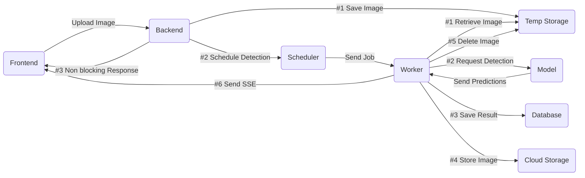

# Visionary - Full-Stack AI Image Detection Portfolio

## Table of Contents

1. [About](#about)
2. [Tech Stack](#tech-stack)
3. [Architecture](#architecture)
4. [Engineering Notes](#engineering-notes)
5. [Start the Demo](#start-the-demo)

## About

Visionary is a working AI image-detection app: upload an image, a background job runs it through an object-detection model, and the predictions come back as bounding boxes drawn over the original.

The product surface is intentionally small: account creation, image upload, asynchronous detection, a paginated results view. The point is how it is built, with three deployable services (frontend, API, model) on a Clean Architecture codebase, asynchronous processing through a queue and a worker, real object storage and caching, and a test suite that runs against live infrastructure instead of mocks.

_Disclaimer: the detection model is a local pre-trained model (COCO-SSD) and is not meant to be accurate. It stands in for a production service such as AWS Rekognition or GCP Vision, and the gateway around it is written so that swap is a single adapter._

## Tech Stack

### Frontend

- **Runtime:** Bun
- **Libraries:** React, React Router, Material UI
- **Forms & Validation:** React Hook Form, Zod
- **Dev Tools:** Vite, TypeScript, ts-prune, ESLint, Prettier

### Backend

- **Runtime:** Bun
- **Framework:** Hono
- **Database ORM:** Drizzle
- **Queues & Caching:** BullMQ + Redis
- **Database:** PostgreSQL
- **Storage:** MinIO (AWS-SDK for S3 compatible API)
- **Real-time Communication:** SSE / EventSource (Frontend notifications)
- **Dev Tools:** TypeScript, ts-prune, ESLint, Prettier, bun:test

### Model

- **Runtime:** Node (TensorFlow requires native bindings)
- **Libraries:** Hono, @tensorflow/tfjs-node, @tensorflow-models/coco-ssd
- **Dev Tools:** TypeScript, ts-prune, ESLint, Prettier, node:test

### Infrastructure

- **Containerization:** Docker
- **CI/CD:** GitHub Actions

## Architecture

The detection workflow is asynchronous from end to end: the upload responds immediately, detection runs as a queued job, and the result is pushed back to the browser over Server-Sent Events.



The upload endpoint does the minimum: save the file to temporary storage, enqueue a job, respond. Everything else (model call, saving the result, moving the image to permanent storage, cleanup, notifying the client) runs in the worker, so a slow or failing model never blocks the request path.

## Engineering Notes

- **Tests run against real infrastructure, not mocks.** The backend suite exercises Postgres, Redis, MinIO, and the model container, all stood up by CI before the run. Database writes roll back per test, Redis and object storage are flushed between tests. Frontend specs mount the real component and fake only the network, and a Cypress run covers signup through prediction end to end.
- **A transaction decorator keeps the wiring invisible.** `@Transaction()` on a handler opens one transaction and runs the whole call inside an `AsyncLocalStorage` context, so downstream code calls `getTransaction()` instead of threading a connection through every collaborator. Commit or rollback happens once, at the boundary.
- **One route, one use case.** Every endpoint maps to a single use case that receives its collaborators as injected ports (validator, presenter, storer, queuer). The frontend follows the same rule: one endpoint, one purpose-built component.
- **The model provider is swappable.** Object detection sits behind a port, so replacing COCO-SSD with Rekognition or Vision is one adapter with no use-case changes.
- **The data-heavy screen is built to stay cheap.** The image listing uses keyset pagination over a compound index, caches each page, invalidates per customer, and the React view splits its state so opening an image re-renders the detail overlay, not the grid.

## Start the Demo

### Prerequisites

You will need [Docker Desktop](https://www.docker.com) installed on your computer.

### Clone and Run

_Note: This project ships with a pre-filled `.env.example` for local convenience. In production, environment variables should be managed securely via Secrets Manager or injected manually. Also the first docker run might take a few minutes (this depends on your device), please be patient._

To start the demo, follow these steps:

```bash
git clone https://github.com/JFServant/33-Visionary.git
cd 33-Visionary
cp .env.example .env
docker compose up -d
```

Once Docker is running, open your browser and go to http://localhost:49432/identity/signup to access the frontend. Create an account (you can use dummy credentials) to test the application.

_Tip: You can test the workflow using the sample images provided in the `/samples` folder. Then remove the demo with the following command: `docker compose down -v --rmi all` at the end._
